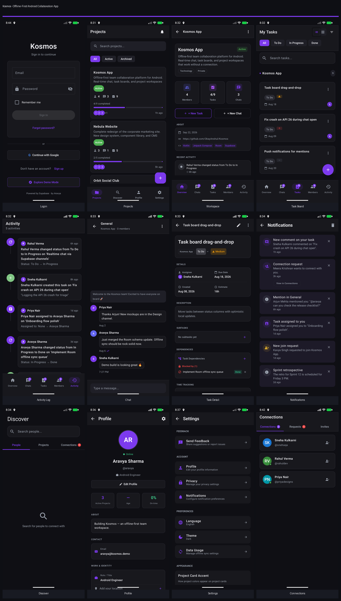
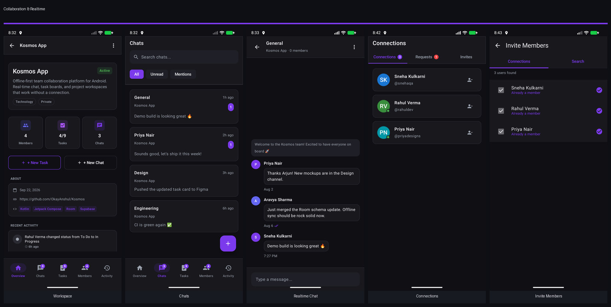
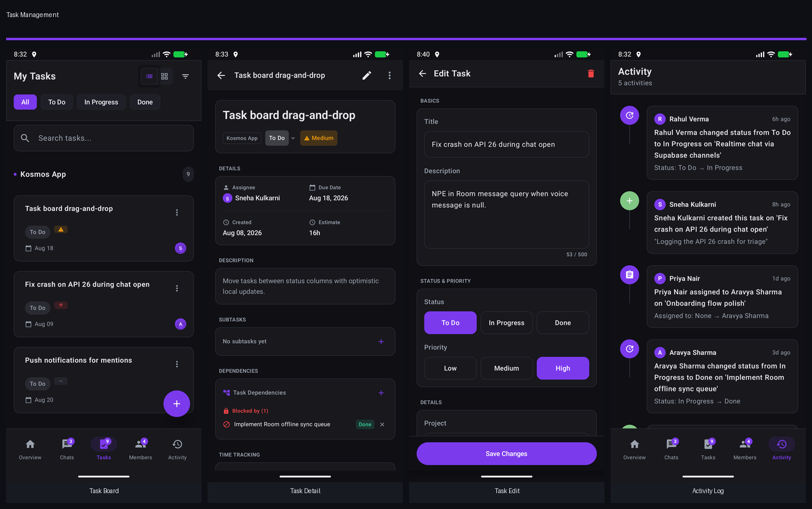
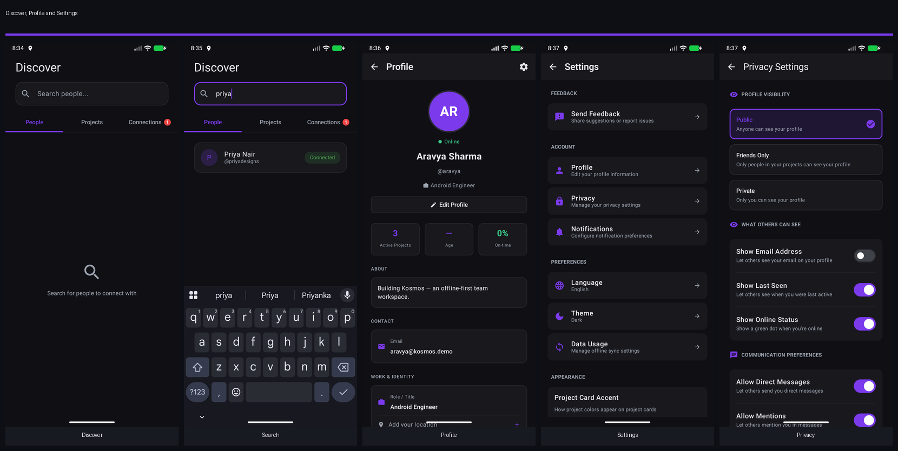

<div align="center">

# Kosmos

**An offline-first Android team collaboration app — chat, tasks, and project workspaces that work without a connection, then converge safely when it's back.**

[](https://github.com/OkayAnshul/Kosmos/actions/workflows/android-tests.yml)


[](https://okayanshul.github.io/kosmos-architecture/)

**[📐 Architecture & Schema Deep Dive](https://okayanshul.github.io/kosmos-architecture/) · [🖼 Screenshot Gallery](https://okayanshul.github.io/kosmos-architecture/gallery.html) · [⚙️ Tech Stack](#tech-stack) · [🚀 Quick Start](#quick-start)**

</div>

<br>



## Why This Project Matters
Kosmos combines project communication and execution into one mobile flow, prioritizes local-first behavior with eventual backend convergence, and is built as a production-oriented codebase with explicit release gates — not a tutorial CRUD app. Solo-built end to end: Android client, Postgres schema, RLS policies, realtime layer, RBAC, and CI.

## Engineering Highlights
| | |
|---|---|
| **14** feature modules | **16** Room entities (DB v12, 12-step migration chain) |
| **26** granular permissions, 3 role tiers | **3** `ConcurrentHashMap` realtime channel pools |
| **112** unit tests passing, 3-job CI pipeline | **84.5k** lines of Kotlin |

- **Offline sync with real conflict resolution** — an exponential-backoff sync queue (capped at 60s, max 5 retries) plus field-level last-write-wins conflict resolution across 9 task fields: disjoint edits auto-merge, true conflicts surface a resolution dialog only when they overlap within a 5s window.
- **Realtime collaboration** — three independently keyed channel pools over Supabase Realtime for messages, tasks, and project members; postgres-change streams plus typing/broadcast channels.
- **RBAC enforced twice** — a `PermissionGated` composable hides unauthorized UI client-side, and Supabase Row-Level Security + `SECURITY DEFINER` RPCs enforce it server-side, so a modified client still can't bypass it.
- **Honest about the rough edges** — known hotspot files, an intentionally deferred namespace/applicationId mismatch, and a couple of documented dead-code paths are called out directly in the [architecture site](https://okayanshul.github.io/kosmos-architecture/architecture.html), not hidden.

→ For the full write-up with diagrams, ER schema, and annotated code, see **[okayanshul.github.io/kosmos-architecture](https://okayanshul.github.io/kosmos-architecture/)**.

## Tech Stack
| Layer | Technology |
|---|---|
| Language | Kotlin 2.2, Coroutines, Flow |
| UI | Jetpack Compose, Material 3 |
| Architecture | MVVM + Repository, offline-first |
| DI | Hilt |
| Local storage | Room 2.8 (16 entities, 12-step migration chain) |
| Backend | Supabase — Postgres, Auth (OAuth 2.0), Realtime (WebSockets), Row-Level Security |
| Background work | WorkManager (tiered task reminders) |
| Images | Coil |
| Testing | JUnit, MockK, Robolectric, Turbine, Compose UI tests |
| CI/CD | GitHub Actions (unit tests + Jacoco coverage + instrumented build), ProGuard/R8 |

## Screens
Captured from the app running in Demo Mode (`BuildConfig.DEMO_MODE_ENABLED`, seeded via `DemoDataSeeder` — no real account or backend required). Full set of 29 individual screens in [`screenshots/`](screenshots/), or browse them all on the [gallery page](https://okayanshul.github.io/kosmos-architecture/gallery.html).





## Quick Start
```bash
git clone git@github.com:OkayAnshul/Kosmos.git && cd Kosmos

# Add your own Supabase project + OAuth client to local.properties
# (never committed — see "Secrets and Safety" below)
cat >> local.properties << 'EOF'
SUPABASE_URL=https://your-project.supabase.co
SUPABASE_ANON_KEY=your-anon-key
GOOGLE_WEB_CLIENT_ID=your-oauth-client-id
EOF

./gradlew assembleDebug     # build
./gradlew testDebugUnitTest # run the unit test suite
```
No Supabase project handy? Launch the app and tap **Explore Demo Mode** on the login screen — it seeds Room with realistic mock data and skips the network entirely.

## Project Status (as of March 2026)
- Android app package ID: `com.aravya.apps.kosmos`
- Kotlin namespace in source: `com.example.kosmos` (intentional transitional debt — see [Decisions Log](docs/DECISIONS.md))
- Build config: `minSdk=26`, `targetSdk=36`, `compileSdk=36`
- Release blockers still open: signed release configuration + final Play Console/legal metadata checks

## Read First
1. [Project One Sheet](docs/PROJECT_ONE_SHEET.md)
2. [Architecture](docs/ARCHITECTURE.md) · [full deep dive ↗](https://okayanshul.github.io/kosmos-architecture/architecture.html)
3. [Codebase Findings](docs/CODEBASE_FINDINGS.md)
4. [Security Model](docs/SECURITY.md)
5. [Testing and Quality](docs/TESTING.md)
6. [Release Runbook](docs/RELEASE.md)

## Planned Improvements (Post Internal Track)
- Close deferred realtime and settings/profile TODO paths.
- Reduce oversized files and improve modularity in high-churn areas.
- Expand end-to-end instrumentation and conflict/retry test coverage.

## Build and Release Commands
```bash
./scripts/preflight_release.sh
./gradlew testDebugUnitTest
./gradlew lintRelease
./gradlew bundleRelease
./scripts/verify_bundle_signature.sh
```

## Secrets and Safety
Do not commit runtime secrets or signing materials.
Use local-only properties for:
- `SUPABASE_URL`, `SUPABASE_ANON_KEY`
- `GOOGLE_WEB_CLIENT_ID`, `GOOGLE_CLOUD_API_KEY`
- `RELEASE_STORE_FILE`, `RELEASE_STORE_PASSWORD`, `RELEASE_KEY_ALIAS`, `RELEASE_KEY_PASSWORD`

## Documentation
- Production docs index: [docs/README.md](docs/README.md)
- Deep-dive site (architecture, schema, engineering case studies): [okayanshul.github.io/kosmos-architecture](https://okayanshul.github.io/kosmos-architecture/)
- Historical/non-production archive: [docs/ARCHIVE_REFERENCES.md](docs/ARCHIVE_REFERENCES.md)

<div align="center">
<sub>Built by <a href="https://github.com/OkayAnshul">OkayAnshul</a></sub>
</div>
